# JOB Portal Microservices

## Monolithic Architecture

Monolithic architecture is a design where all the components of an application are interconnected and interdependent.

### Problems with Monolithic Architecture

- Difficult to Implement Changes
- Lack of Scalability
- Long-term Commitment to a Single Technology Stack
- Increased Application Complexity
- Increased Application Start Time
- Large Project Size
- Deploying for Small Changes
- Team Collaboration and Autonomy Issues
- Slowing Down of IDEs

## Microservices

Microservices structure an application as a collection of small autonomous services.

<div style="display:flex; gap:2px">

<div style="text-align: center;">
  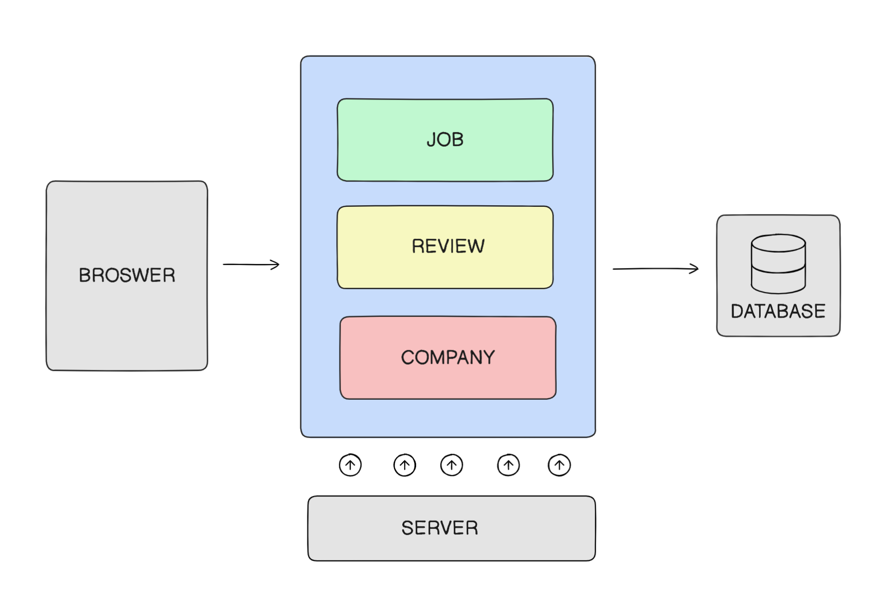
  <p>Monolithic Architecture</p>
</div>

<div style="text-align: center;">
  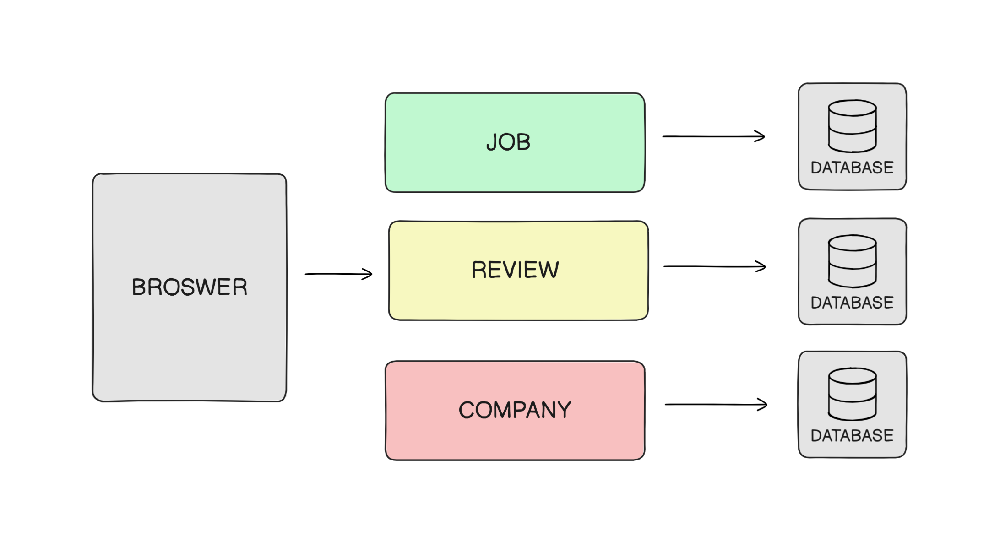
  <p>Microservices Architecture</p>
</div>

</div>

<div style="display:flex; gap:2px">
<div style="width:50%">

### Principles of Microservices

- Single Responsibility
- Independence
- Decentralization
- Failure Isolation
- Continuous Delivery/Deployment
</div>

<div style="width:50%">

### How Microservices Address the Problems of Monolithic Architecture

- Scalability
- Flexibility
- Simplicity

</div>
</div>

## Development Port of service

<div style="display:flex; gap:2px;justify-content: start;">
<div style="width:50%">

| Service | Port |
| ------- | ---- |
| Company | 8081 |
| Review  | 8083 |
| Job     | 8082 |
| Gatway     | 8084 |

</div>
<div style="width:50%">

| Service | Port |
| ------- | ---- |
| service-reg     | 8761 |
| config-server     | 8080 |
| zipkin     | 9411 |
| rabbitmq     | 5672 |

</div>
</div>


## Ways to Implement Inter-Services Communication

- **Synchronous Communication**: REST Template
- **Asynchronous Communication**: RabbitMQ, Kafka

## RestTemplate

  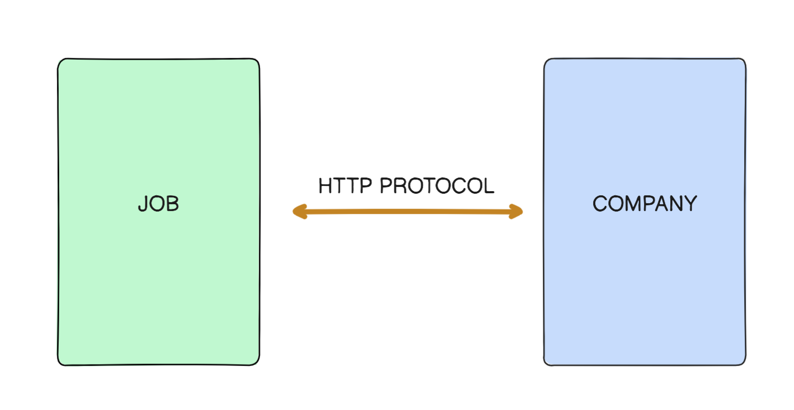

### Features and Advantages of RestTemplate

- Abstraction
- Versatility
- Conversion
- Error Handling
- Integration

### Example Usage

```java
Company company = restTemplate.getForObject("http://COMPANY-SERVICE/companies/" + job.getCompanyId(), Company.class);
```

## DTO Pattern

Design pattern used to transfer data between software application subsystems.

  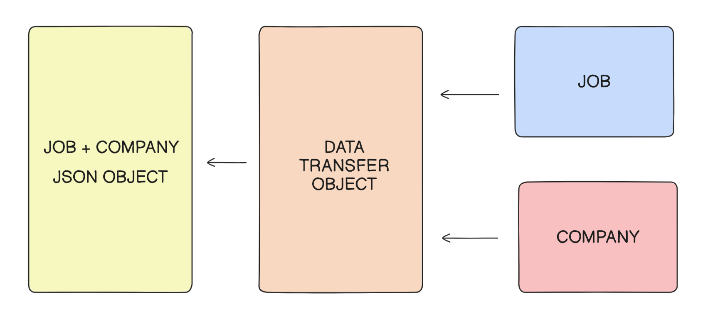


## Service Registry - Inter-Service Communication

A service registry is used in microservices architectures to enable dynamic service discovery.

<div style="display:flex; gap:2px;">


<div style="text-align: center;">

  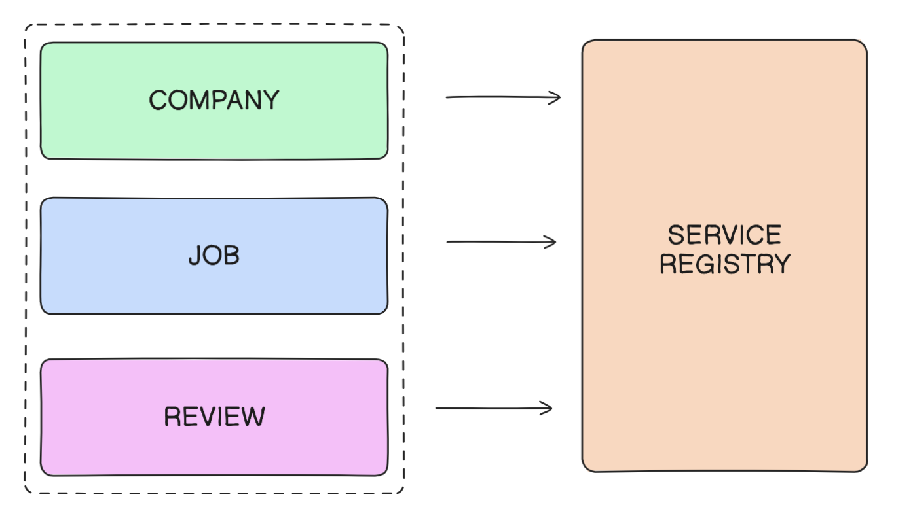
</div>

<div style="text-align: center;">

  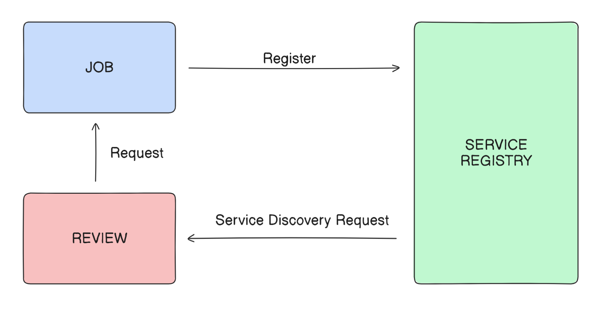
</div>

</div>


### Benefits of Service Registry

- Dynamic Service Discovery
- Load Balancing
- Fault Tolerance and Resilience
- Scalability and Elasticity
- Service Monitoring and Health Checks

## OpenFeign

Feign is a declarative web service client designed to make writing HTTP clients easier.

```java
Company company = companyClient.getCompany(job.getCompanyId());
```

### Why Use OpenFeign

- Ease of Use
- Integration with Eureka
- Built-in Load Balancing with Ribbon
- Support for FallBacks and Circuit Breakers

## Distributed Tracing

Distributed Tracing enables you to trace your request from start to end.

### Problems that Distributed Tracing Solves

- Request Visualization
- Identify Performance Bottlenecks
- Error Analysis and Debugging
- Tracking Dependency
- Performance Optimization

## What is Zipkin?

Zipkin is an open-source distributed tracing system.
<div style="display:flex; gap:2px;">

<div style="text-align: center;">

  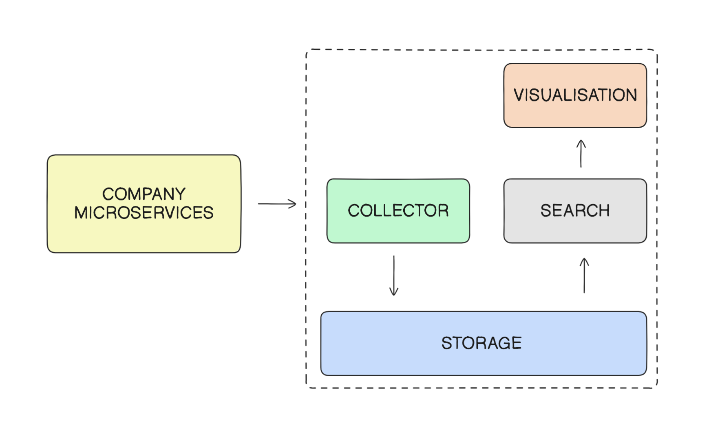
</div>

<div style="text-align: center;">

  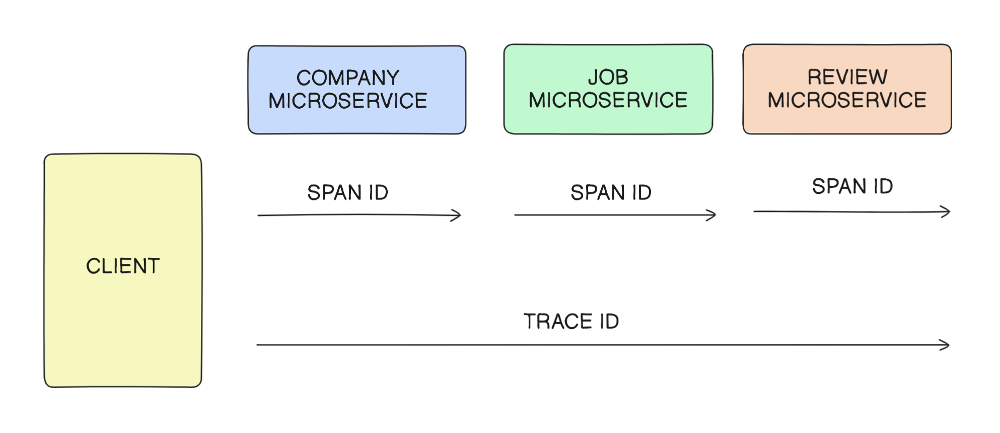
</div>
</div>


## Micrometer

### How Micrometer Helps

- Helps you collect metrics from your application
- Acts as a middleman or a bridge between your application and the metrics collection systems
- Offers a vendor-neutral interface
- Simplifies the process of collecting metrics from your application

## Configuration Management

Managing and controlling the configurations of each microservice in the system.

  
  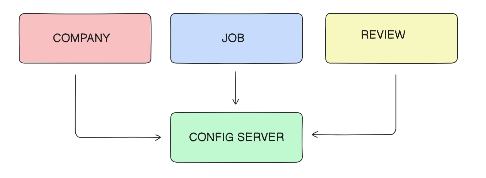
<div style="display:flex; gap:2px">
<div style="width:50%">

### Features of a Config Server

- Centralized and Versioned Configuration
- Dynamic Updates
- Security
- Application and Profile Specific Configuration
</div>

<div style="width:50%">

### Benefits of a Config Server

- Single Source of Truth
- Easier to Manage and Update Configurations
- Enhances Security and Control
- Easy to Deploy and Scale Microservices

</div>
</div>


## Spring Cloud Config Server

Spring Cloud Config Server is part of the Spring Cloud project, a suite of tools specifically designed for building and managing cloud-native applications.


  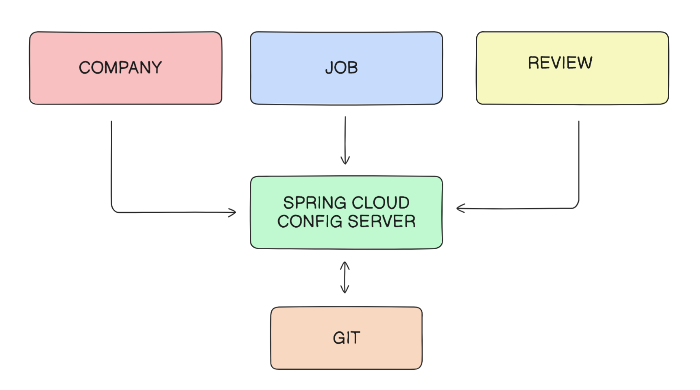


### Capabilities

- Storing Configurations
- Serving Configurations
- Refreshing Configurations
- Easy Integration with Spring Boot
- Support for Different Environments
- Encryption and Decryption

## API Gateway

An API Gateway encapsulates the internal system architecture and handles cross-cutting concerns like security, load balancing, rate limiting, and analytics.

<div style="display:flex; gap:2px">
<div style="width:50%">

### Advantages

- Encapsulates the Internal System Architecture
- Handles Cross-Cutting Concerns
- Can Authenticate Incoming Requests
- Aggregates Responses from Different Microservices
- Simplifies Client Interactions
</div>

<div style="width:50%">

### Capabilities of API Gateway

- Request Routing
- Load Balancing
- Authentication and Authorization
- Rate Limiting
- Request and Response Transformation
- Aggregation of Data from Multiple Services

</div>
</div>


---


  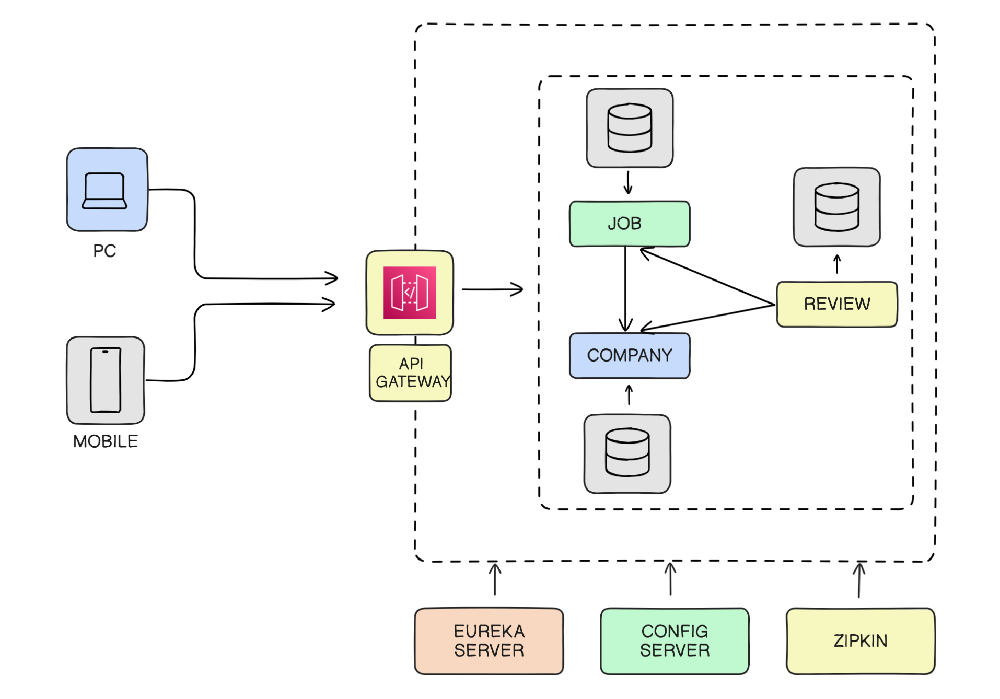


## Fault Tolerance

The ability to continue operating without interruption.

### Need for Fault Tolerance

- Fault Isolation
- Network Latency
- Deployment Issues
- Increased Complexity
- Elasticity
- Tolerating External Failures

## Resilience

The ability or capacity to recover quickly from difficulties.

### Techniques

- Retries
- Rate Limiting
- Bulkheads
- Circuit Breakers
- Fallbacks
- Timeouts
- Graceful Degradation

### Resilience4J

Resilience4J is a lightweight, easy-to-use fault tolerance library.


#### Why It's a Good Choice

- Easy Integration with Spring Boot
- Built for Functional Programming Paradigms

#### Resilience4J Modules

- Retry Module
- RateLimiter
- Bulkhead
- CircuitBreaker

#### Retry Module

Enables easy implementation of retry logic in applications.

#### Bulkhead

Isolates failures and prevents them from cascading through the system.

#### CircuitBreaker

Prevents a network or service failure from cascading to other services.

  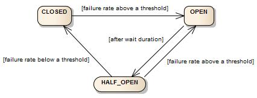


### Rate Limiting

A technique for limiting network traffic.

#### Importance of Rate Limiting

- Preventing Abuse
- Resource Allocation
- Cost Management

#### Use Cases of Rate Limiting

- APIs
- Web Scraping
- Login Attempts

### Distributed Denial of Service (DDoS) Attacks

DDoS attacks can be mitigated using rate limiting.

## Message Queue

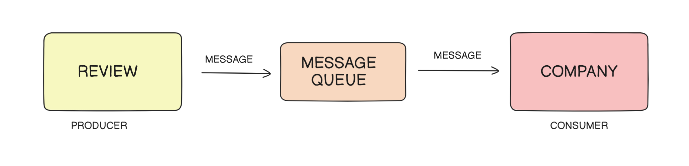

### Need for Message Queues

- Decoupling
- Asynchronous Communication
- Scalability
- Fault Tolerance
- Event-Driven Architecture
- Time Decoupling

### Message Queues

A message queue is a form of asynchronous service-to-service communication used in serverless and microservices architectures.

## Deployment

### Execution of Spring Boot Application

- Code Compilation
- Running the Main Class
- Classpath and Dependencies
- Embedded Server
- Source Code Changes
- Development Mode

### What is Packaging?

Packaging involves compiling your source code into bytecode, bundling it with any dependent libraries, and creating a single, executable artifact that can be easily distributed and run.

  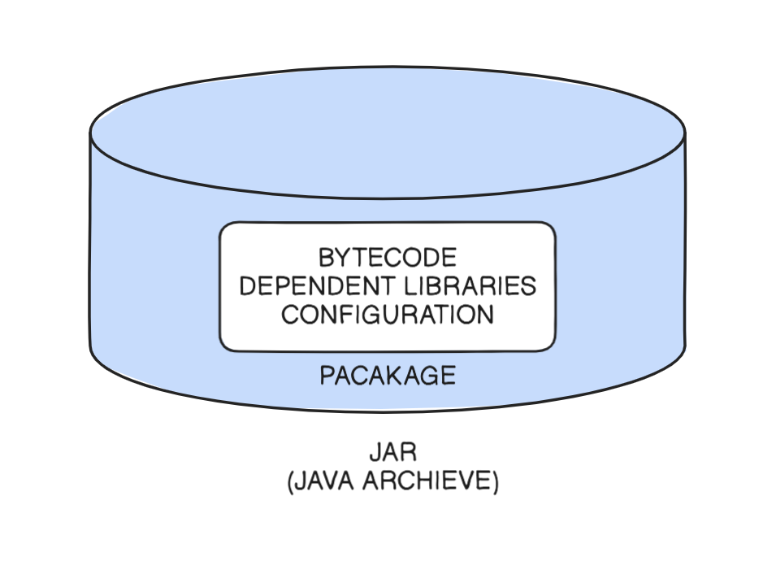


<div style="display:flex; gap:2px">
<div style="width:50%">

### Benefits of JAR

- Simplified Deployment
- Inclusion of Everything Our Application Needs
- JRE Executes JAR Files
</div>

<div style="width:50%">

### Other Packaging Options

- WAR
- EAR
- Docker Image

</div>
</div>


### Commands

```sh
mvn clean
mvn package
mvn clean package
```

### Kubernetes Story

The story of Kubernetes begins with Google, which built a system called Borg. Borg was open-sourced and called Kubernetes or k8s.

## Kubernetes

Kubernetes is a platform designed to manage the lifecycle of containerized applications using methods that provide predictability, scalability, and high availability.

### Benefits

- Service Discovery and Load Balancing
- Automated Rollouts and Rollbacks
- Horizontal Scaling
- Self-Healing
- Secret and Configuration Management

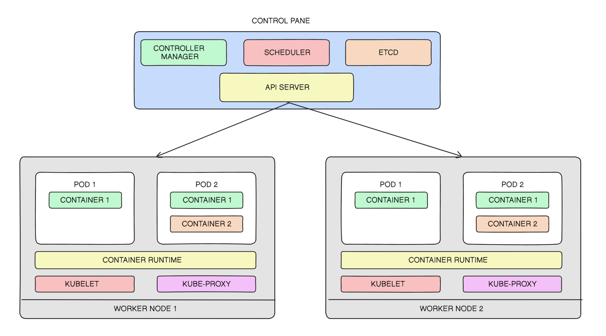

### What is a Pod?

A pod groups one or more containers and their shared resources, such as volumes (storage), IP address, and network ports.

#### Key Considerations

- Designed to be Stateless
- Communicate with Each Other Within the Same Cluster Using `localhost`
- Pods are Assigned a Unique IP Address Within the Cluster
- Lifecycle and Availability of Pods are Managed by Kubernetes
- Pods Can Have Associated Labels and Annotations

```yaml
apiVersion: v1
kind: Pod
metadata:
  name: my-pod
spec:
  containers:
    - name: nginx
      docs/images/image: nginx:1.14.2
      ports:
        - containerPort: 80
    - name: redis
      docs/images/image: redis:6.2.5
```

## Service

A Service in Kubernetes is an abstraction that defines a logical set of Pods and a policy by which to access them, sometimes called a micro-service.

### Why Do We Need It?

Pods in Kubernetes are ephemeral; they can be created and destroyed.

```yaml
apiVersion: v1
kind: Service
metadata:
  name: my-service
spec:
  selector:
    app: MyApp
  ports:
    - protocol: TCP
      port: 80
      targetPort: 9376
```

### Types of Service

- ClusterIP
- NodePort
- LoadBalancer

## ReplicaSet

A ReplicaSet is a Kubernetes object used for managing and scaling a set of identical pod replicas.

### Why Do You Need Identical Pods?

- High Availability
- Load Balancing
- Scaling
- Rolling Updates
- Service Discovery and Load Balancing

### What a ReplicaSet is Not

- Not Designed to Handle Rolling Updates or Deployments
- Does Not Provide Declarative Updates to the Pods It Manages

### What to Keep in Mind

- ReplicaSets Use a Selector to Identify the Pods It Manages
- You Specify the Desired Number of Replicas
- If a Pod Managed by a ReplicaSet Fails or Gets Deleted, the ReplicaSet Replaces It Automatically to Maintain the Desired Replica Count
- ReplicaSets are Often Used Together with Deployments

```yaml
apiVersion: apps/v1
kind: ReplicaSet
metadata:
  name: my-replicaset
spec:
  replicas: 3
  selector:
    matchLabels:
      app: nginx
  template:
    metadata:
      labels:
        app: nginx
    spec:
      containers:
        - name: nginx
          docs/images/image: nginx:1.14.2
          ports:
            - containerPort: 80
```

---

This README provides a comprehensive overview of the JOB Portal Microservices project, covering key concepts, technologies, and best practices.
